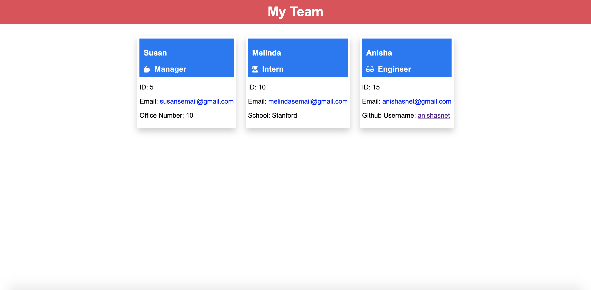

# Team Profile Generator

## Description
This project uses inquirer to prompt the user about the team they would like to build an HTML page for. They can include one manager, and multiple engineers and interns. There are also test cases written using jest. The program then takes the information about the team members that the username inputs and creates a formatted HTML page with cards on the team members' information. When the emails are clicked on then the user's default email program opens and the to field is populated with the team member's email. When the github username is clicked the user is taken to their GitHub profile. Here is a walkthrough to better understand the project: https://drive.google.com/file/d/1IB1Y9aM82esGVwzW4kFnWZmODTOObNPF/view?usp=sharing


## Table of Contents
* [Installation](#installation)
* [Usage](#usage)
* [Contributing](#contributing)
* [Tests](#tests)
* [Preview](#preview)
* [Questions](#questions)

## Installation

To install neccesary dependencies, run the following command:

```
npm init
```

## Usage

The repositroy creates the index.html file in the dist directory. This is the file to be opened to see the HTML page as it would appear on the web.

## Contributing

No special instructions.

## Tests

To run tests on the project, use the following command:


```
npm run test
```

## Preview


## Questions

For any further questions please email anishasnet@gmail.com. You can find more of my work at [anishasnet](https://github.com/anishasnet).
    